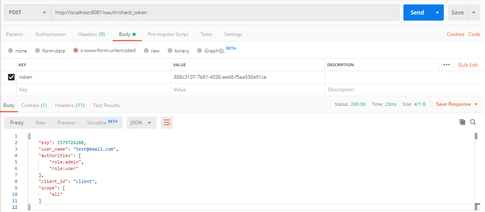

# In memory H2 database console
  
- http://localhost:8080/h2-console

# OAuth2 Authorization end point

## Obtain a token

  - POST http://localhost:8081/oauth/token
  
    
  
    
  
## Check a token

  - POST http://localhost:8081/oauth/check_token

    
  
    
  

### Database password BCrypt

- https://www.browserling.com/tools/bcrypt

- http://localhost:8081/oauth/check_token?token=b5bad5a8-2df3-441a-8c4f-73ba237a2741

### References

- https://pattern-match.com/blog/2018/10/17/springboot2-with-oauth2-integration/

- https://projects.spring.io/spring-security-oauth/docs/oauth2.html
- https://projects.spring.io/spring-security-oauth/docs/oauth2.html#resource-server-configuration
