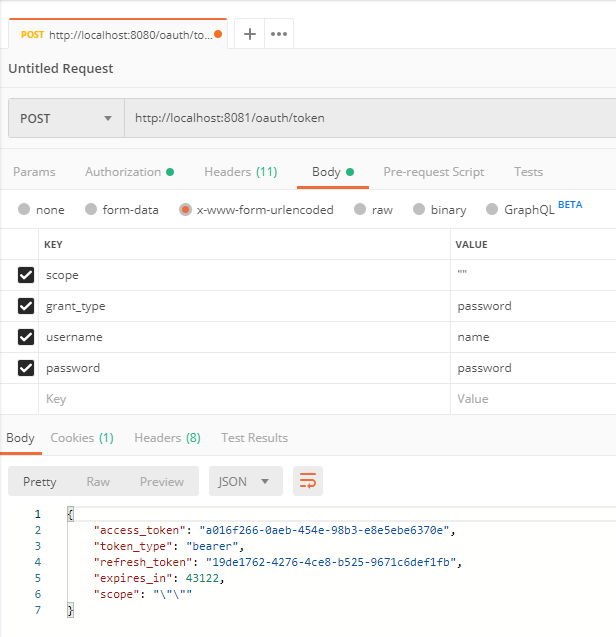

# OAuth2 

### In memory H2 database console
- http://localhost:8080/h2-console

### Authorization end point

POST http://localhost:8081/oauth/token

### Database password BCrypt

- https://www.browserling.com/tools/bcrypt

http://localhost:8081/oauth/check_token?token=b5bad5a8-2df3-441a-8c4f-73ba237a2741
